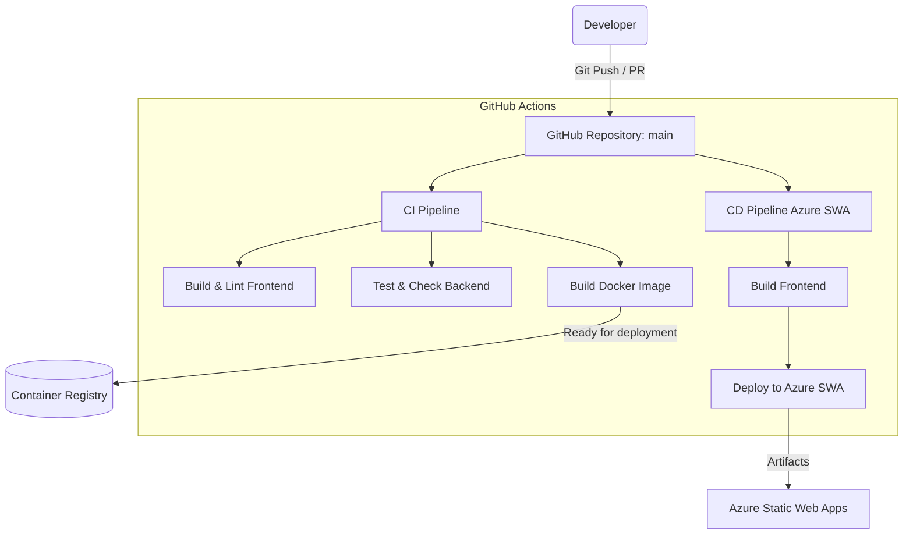

# CI/CD Pipeline Architecture

```mermaid
graph TD
    Developer(Developer) -->|Git Push / PR| GitHub[GitHub Repository: main]
    
    subgraph GitHub Actions
        GitHub --> CI[CI Pipeline]
        CI --> BuildFrontend[Build & Lint Frontend]
        CI --> TestBackend[Test & Check Backend]
        CI --> BuildDocker[Build Docker Image]
        
        GitHub --> CD[CD Pipeline Azure SWA]
        CD --> Build[Build Frontend]
        Build --> Deploy[Deploy to Azure SWA]
    end
    
    Deploy -->|Artifacts| Azure[Azure Static Web Apps]
    BuildDocker -->|Ready for deployment| ContainerRegistry[(Container Registry)]
```
